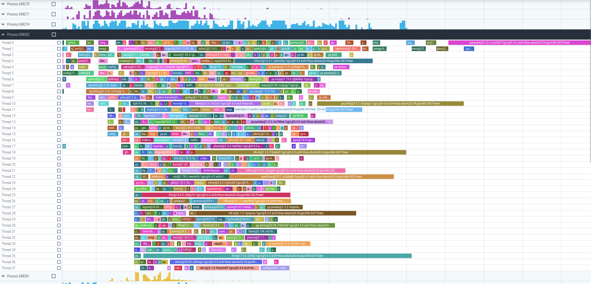

Usage

```console
$ waterfall.sh https://gitlab.spack.io/spack/spack/-/pipelines/698256
/path/to/trace.json
```

Open `trace.json` in `https://ui.perfetto.dev` or `chrome://tracing`.

It should look like this

